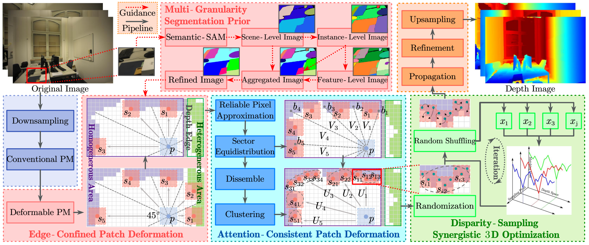

# MSP-MVS

Zhenlong Yuan, Cong Liu, Fei Shen, Zhaoxin Li, Jingguo luo, Tianlu Mao and Zhaoqi Wang, [**MSP-MVS: Multi-Granularity Segmentation Prior Guided Multi-View Stereo**](https://arxiv.org/pdf/2407.19323), AAAI 2025


## About
MSP-MVS is the first method who combines the instance segmentation model **SAM** with multi-view stereo(**MVS**) algorithm to address limited receptive field of PatchMatch-based MVS.

Our paper was accepted by **AAAI2025**!

If you find this project useful for your research, please cite:  

```
@InProceedings{MSP-MVS,
  title = {{{MSP-MVS}}: {{Multi-Granularity Segmentation Prior Guided Multi-View Stereo}}},
  shorttitle = {{{MSP-MVS}}},
  author = {Yuan, Zhenlong and Liu, Cong and Shen, Fei and Li, Zhaoxin and Luo, Jinguo and Mao, Tianlu and Wang, Zhaoqi},
  year = {2024},
  month = dec,
  number = {arXiv:2407.19323},
  eprint = {2407.19323},
  primaryclass = {cs},
  publisher = {arXiv},
  archiveprefix = {arXiv}
}
```
## Code
Code is coming soon.

## Acknowledgements

This code largely benefits from the following repositories: [APD-MVS](https://github.com/whoiszzj/APD-MVS), [Semantic-SAM](https://github.com/UX-Decoder/Semantic-SAM) and [ACMMP](https://github.com/GhiXu/ACMMP.git). Thanks to their authors for opening the source of their excellent works.
